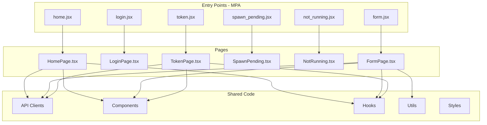

# Route-Based Project Structure Plan (Multi-Page Application)

## Overview

This document outlines the plan to reorganize the `src` directory from a type-based structure to a **route-based structure** for a **Multi-Page Application (MPA)**. Each page has its own entry point and is built independently by Vite. This approach groups files by their functional route/feature, making the codebase more maintainable and easier to navigate.

## Current Structure (Type-Based)

```
src/
├── api/                    # Shared API clients
├── assets/                 # Static assets (fonts, images)
├── components/             # Shared UI components
├── data/                   # Static data files
├── formSections/           # Form section components
├── hooks/                  # Shared custom hooks
├── pages/                  # Page components
├── scripts/                # Utility scripts
├── styles/                 # Global styles
├── utils/                  # Utility functions
├── dev-setup.ts            # Dev mode configuration
├── form.jsx                # Entry point: Form
├── home.jsx                # Entry point: Home
├── login.jsx               # Entry point: Login
├── not_running.jsx         # Entry point: Not Running
├── spawn_pending.jsx       # Entry point: Spawn Pending
├── token.jsx               # Entry point: Token
└── vite-env.d.ts           # Vite type definitions
```

## Proposed Structure (Route-Based for MPA)

```
src/
├── routes/                         # Route-specific code
│   ├── home/                       # home.html entry point
│   │   ├── home.jsx                # Entry point (moved from src/home.jsx)
│   │   ├── HomePage.tsx            # Main page component (moved from pages/)
│   │   ├── components/             # Route-specific components
│   │   │   └── ServerList.tsx
│   │   ├── hooks/                  # Route-specific hooks
│   │   │   └── useSpawners.ts
│   │   └── styles/                 # Route-specific styles
│   │       └── HomePage.css
│   │
│   ├── login/                      # login.html entry point
│   │   ├── login.jsx               # Entry point (moved from src/login.jsx)
│   │   ├── LoginPage.tsx           # Main page component
│   │   └── components/
│   │
│   ├── spawn/                      # spawn.html entry point
│   │   ├── form.jsx                # Entry point (moved from src/form.jsx)
│   │   ├── FormPage.tsx            # Main page component
│   │   ├── components/             # Form sections moved here
│   │   │   ├── ImageSection.tsx
│   │   │   ├── ResourceSection.tsx
│   │   │   └── StorageSection.tsx
│   │   ├── hooks/
│   │   │   └── useFormSubmission.ts
│   │   └── utils/
│   │       └── gatherFormData.ts   # Moved from scripts/
│   │
│   ├── spawn-pending/              # spawn_pending.html entry point
│   │   ├── spawn_pending.jsx       # Entry point (moved from src/spawn_pending.jsx)
│   │   ├── SpawnPending.tsx        # Main page component
│   │   └── hooks/
│   │       └── useSpawnProgress.ts
│   │
│   ├── not-running/                # not_running.html entry point
│   │   ├── not_running.jsx         # Entry point (moved from src/not_running.jsx)
│   │   └── NotRunning.tsx          # Main page component
│   │
│   └── token/                      # token.html entry point
│       ├── token.jsx               # Entry point (moved from src/token.jsx)
│       ├── TokenPage.tsx           # Main page component
│       └── hooks/
│           └── useTokens.ts
│
├── shared/                         # Shared code across routes
│   ├── api/                        # API clients
│   │   ├── JupyterHubAPI.ts
│   │   ├── GrafanaAPI.ts
│   │   └── GPUIndicatorsAPI.ts
│   │
│   ├── components/                 # Reusable UI components
│   │   ├── ui/                     # Base UI components
│   │   │   ├── Alert.tsx
│   │   │   ├── Button/
│   │   │   ├── Dialog/
│   │   │   └── ...
│   │   ├── layout/                 # Layout components
│   │   │   ├── JupyterHubHeader.tsx
│   │   │   ├── EinfraFooter.tsx
│   │   │   └── ThemeProvider.tsx
│   │   └── features/               # Feature components used across routes
│   │       ├── ServerCard/
│   │       ├── GPUStatusIndicator/
│   │       ├── TileSelector/
│   │       └── ...
│   │
│   ├── hooks/                      # Shared custom hooks
│   │   ├── useAlerts.ts
│   │   └── useGPUStatus.ts
│   │
│   ├── utils/                      # Utility functions
│   │   ├── shine.ts
│   │   └── utils.ts
│   │
│   ├── data/                       # Static data
│   │   └── formData.js
│   │
│   └── styles/                     # Global styles
│       └── index.css
│
├── assets/                         # Static assets (fonts, images)
│   └── font/
│
├── dev-setup.ts                    # Dev mode configuration
└── vite-env.d.ts                   # Vite type definitions
```

## Route Mapping (Multi-Page Application)

| HTML Entry           | Entry Point                              | Page Component     | JupyterHub Route                     | Description                   |
| -------------------- | ---------------------------------------- | ------------------ | ------------------------------------ | ----------------------------- |
| `home.html`          | `routes/home/home.jsx`                   | `HomePage.tsx`     | `/hub/`                              | Dashboard showing all servers |
| `login.html`         | `routes/login/login.jsx`                 | `LoginPage.tsx`    | `/hub/login`                         | OAuth login page              |
| `spawn.html`         | `routes/spawn/form.jsx`                  | `FormPage.tsx`     | `/hub/spawn/:user?/:server?`         | Server spawn configuration    |
| `spawn_pending.html` | `routes/spawn-pending/spawn_pending.jsx` | `SpawnPending.tsx` | `/hub/spawn-pending/:user?/:server?` | Server startup progress       |
| `not_running.html`   | `routes/not-running/not_running.jsx`     | `NotRunning.tsx`   | `/hub/not-running`                   | Server not running prompt     |
| `token.html`         | `routes/token/token.jsx`                 | `TokenPage.tsx`    | `/hub/token`                         | API token management          |

## Vite Configuration Analysis

### Current Configuration

The [`vite.config.js`](vite.config.js:1) is configured for Multi-Page Application builds:

```javascript
export default defineConfig({
  base: "/",
  build: {
    outDir: "./dist_hub",
    rollupOptions: {
      input: {
        spawn: resolve(__dirname, "spawn.html"),
        login: resolve(__dirname, "login.html"),
        spawn_pending: resolve(__dirname, "spawn_pending.html"),
        home: resolve(__dirname, "home.html"),
        not_running: resolve(__dirname, "not_running.html"),
        token: resolve(__dirname, "token.html"),
      },
      // ... output configuration
    },
  },
  plugins: [react(), tailwindcss()],
});
```

### Required Changes

**Vite config (`vite.config.js`):** No changes needed - HTML files stay at root level.

**HTML files:** Need to update script tag paths to point to new entry point locations:

| HTML File            | Current Script Path     | New Script Path                              |
| -------------------- | ----------------------- | -------------------------------------------- |
| `home.html`          | `src/home.jsx`          | `src/routes/home/home.jsx`                   |
| `login.html`         | `src/login.jsx`         | `src/routes/login/login.jsx`                 |
| `spawn.html`         | `src/form.jsx`          | `src/routes/spawn/form.jsx`                  |
| `spawn_pending.html` | `src/spawn_pending.jsx` | `src/routes/spawn-pending/spawn_pending.jsx` |
| `not_running.html`   | `src/not_running.jsx`   | `src/routes/not-running/not_running.jsx`     |
| `token.html`         | `src/token.jsx`         | `src/routes/token/token.jsx`                 |

### Recommended: Add Path Aliases

Add path aliases to simplify imports in the Vite config:

```javascript
import { defineConfig } from "vite";
import { resolve } from "path";
import react from "@vitejs/plugin-react";
import tailwindcss from "@tailwindcss/vite";

export default defineConfig({
  base: "/",
  resolve: {
    alias: {
      "@routes": resolve(__dirname, "src/routes"),
      "@shared": resolve(__dirname, "src/shared"),
      "@components": resolve(__dirname, "src/shared/components"),
      "@hooks": resolve(__dirname, "src/shared/hooks"),
      "@utils": resolve(__dirname, "src/shared/utils"),
      "@api": resolve(__dirname, "src/shared/api"),
      "@assets": resolve(__dirname, "src/assets"),
    },
  },
  build: {
    // ... existing build config
  },
  plugins: [react(), tailwindcss()],
});
```

## Migration Steps

### Phase 1: Create New Directory Structure

1. Create `routes/` directory with subdirectories for each route:
   - `routes/home/`
   - `routes/login/`
   - `routes/spawn/`
   - `routes/spawn-pending/`
   - `routes/not-running/`
   - `routes/token/`
2. Create `shared/` directory with subdirectories for shared code
3. Create `shared/components/ui/`, `shared/components/layout/`, `shared/components/features/`

### Phase 2: Migrate Shared Code

1. Move API clients to `shared/api/`:
   - `src/api/JupyterHubAPI.ts` → `src/shared/api/JupyterHubAPI.ts`
   - `src/api/GrafanaAPI.ts` → `src/shared/api/GrafanaAPI.ts`
   - `src/api/GPUIndicatorsAPI.ts` → `src/shared/api/GPUIndicatorsAPI.ts`
2. Move shared hooks to `shared/hooks/`:
   - `src/hooks/useAlerts.js` → `src/shared/hooks/useAlerts.ts`
   - `src/hooks/useGPUStatus.ts` → `src/shared/hooks/useGPUStatus.ts`
3. Move utility functions to `shared/utils/`:
   - `src/utils/shine.ts` → `src/shared/utils/shine.ts`
   - `src/utils/utils.ts` → `src/shared/utils/utils.ts`
4. Move static data to `shared/data/`:
   - `src/data/formData.js` → `src/shared/data/formData.js`
5. Move global styles to `shared/styles/`:
   - `src/styles/index.css` → `src/shared/styles/index.css`
6. Reorganize components into `shared/components/`:
   - Layout components → `shared/components/layout/`
   - Feature components → `shared/components/features/`
   - Base UI components → `shared/components/ui/`

### Phase 3: Migrate Routes

For each route, move files to their new locations:

**Home Route:**

- `src/home.jsx` → `src/routes/home/home.jsx`
- `src/pages/HomePage.jsx` → `src/routes/home/HomePage.tsx`
- `src/styles/HomePage.css` → `src/routes/home/styles/HomePage.css`

**Login Route:**

- `src/login.jsx` → `src/routes/login/login.jsx`
- `src/pages/LoginPage.jsx` → `src/routes/login/LoginPage.tsx`
- `src/styles/Login.css` → `src/routes/login/styles/Login.css`

**Spawn Route:**

- `src/form.jsx` → `src/routes/spawn/form.jsx`
- `src/pages/FormPage.jsx` → `src/routes/spawn/FormPage.tsx`
- `src/formSections/*.tsx` → `src/routes/spawn/components/`
- `src/scripts/gatherFormData.ts` → `src/routes/spawn/utils/gatherFormData.ts`
- `src/styles/Form.css` → `src/routes/spawn/styles/Form.css`

**Spawn-Pending Route:**

- `src/spawn_pending.jsx` → `src/routes/spawn-pending/spawn_pending.jsx`
- `src/pages/SpawnPending.jsx` → `src/routes/spawn-pending/SpawnPending.tsx`
- `src/styles/SpawnPending.css` → `src/routes/spawn-pending/styles/SpawnPending.css`

**Not-Running Route:**

- `src/not_running.jsx` → `src/routes/not-running/not_running.jsx`
- `src/pages/NotRunning.jsx` → `src/routes/not-running/NotRunning.tsx`
- `src/styles/NotRunning.css` → `src/routes/not-running/styles/NotRunning.css`

**Token Route:**

- `src/token.jsx` → `src/routes/token/token.jsx`
- `src/pages/TokenPage.jsx` → `src/routes/token/TokenPage.tsx`

### Phase 4: Update Imports

1. Update all import paths to reflect new structure
2. Update relative imports within routes
3. Update imports to shared code using absolute or aliased paths

### Phase 5: Update Build Configuration

1. Update Vite configuration for new entry points
2. Update `package.json` scripts if needed
3. Update TypeScript path mappings (if using)

## Benefits

1. **Better Code Organization**: Files related to the same feature are grouped together
2. **Easier Navigation**: Developers can quickly find all code for a specific route
3. **Better Separation of Concerns**: Clear distinction between route-specific and shared code
4. **Scalability**: Easy to add new routes without affecting existing code
5. **Code Ownership**: Each route can be owned/maintained independently
6. **Easier Testing**: Route-specific tests can be colocated with route code

## Considerations

1. **Import Path Complexity**: May need to configure TypeScript path aliases for cleaner imports
2. **Shared Component Decision**: Need clear guidelines on when a component should be shared vs route-specific
3. **Migration Effort**: Requires updating many import statements across the codebase

## Recommended TypeScript Path Aliases

Add to `tsconfig.json` or `vite.config.js`:

```json
{
  "compilerOptions": {
    "paths": {
      "@routes/*": ["./src/routes/*"],
      "@shared/*": ["./src/shared/*"],
      "@components/*": ["./src/shared/components/*"],
      "@hooks/*": ["./src/shared/hooks/*"],
      "@utils/*": ["./src/shared/utils/*"],
      "@api/*": ["./src/shared/api/*"],
      "@assets/*": ["./src/assets/*"]
    }
  }
}
```

## Example Import Changes

### Before:

```typescript
import { JupyterHubApiClient } from "../api/JupyterHubAPI";
import { ServerCard } from "../components/ServerCard/ServerCard";
import { useAlerts } from "../hooks/useAlerts";
```

### After:

```typescript
import { JupyterHubApiClient } from "@api/JupyterHubAPI";
import { ServerCard } from "@components/features/ServerCard/ServerCard";
import { useAlerts } from "@hooks/useAlerts";
```

## Mermaid Diagram


